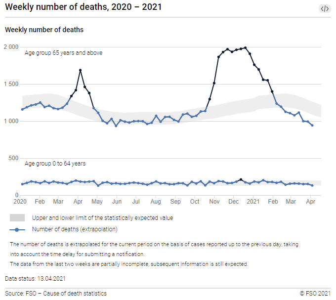

```{r setup, include = FALSE}
knitr::opts_knit$set(root.dir = rprojroot::find_rstudio_root_file())

options(scipen=999)
set.seed(12345)

library(pacman)
p_load(tidyverse, lubridate, scales, magrittr,
       ciTools)

options(max.print = "75")
knitr::opts_chunk$set(cache = FALSE,
                      prompt = FALSE,
                      tidy = FALSE,
                      comment = NA,
                      message = FALSE,
                      warning = FALSE)
knitr::opts_knit$set(width = 75)

mu <- Hmisc::markupSpecs$html
```

<!-- ----------------------------------------------------- -->

# Years

```{r}
year <- 2020

year_from <- year - 5
date_from <- ymd(paste0(as.character(year_from), "-01-01"))

year_reg <- year - 1
date_reg <- ymd(paste0(as.character(year_reg), "-01-01"))

date_min <- ymd(paste0(as.character(year), "-01-01"))
date_max <- ymd(paste0(as.character(year), "-12-31"))
flu_years <- c(1889, 1890, 1918, 1919, 2020, 1957, 1958, 1968, 1969, 1977, 1978, 1979, 2009, 2010, 2020)
```

<!-- ----------------------------------------------------- -->

# Gold(ish) standard

```{r echo=FALSE,eval=FALSE, out.width='100%'}
path <- paste0("./data/BfS/orig_plots/", as.character(year), ".png")
knitr::include_graphics(path)
```


<!-- ----------------------------------------------------- -->

# Data 

## Weekly number of deaths, 2010-2020

Prepared in `03.Rmd`.  Collapsing age groups. 

```{r}
bfs_web_deaths_weekly <- read_rds("data/BfS/bfs_web_deaths_weekly_2010-2019.Rds")  %>% 
  bind_rows(read_rds("data/BfS/bfs_web_deaths_weekly_2020-2021.Rds") %>%
              filter(Ending <= ymd("2020-12-31"))) %>% 
  group_by(Year, Week, Ending) %>% 
  summarise(NumberOfDeaths = sum(NumberOfDeaths),
            Expected = sum(Expected)) %>% 
  ungroup() %>% 
  mutate(Excess_expected = NumberOfDeaths - Expected,
         Week_2 = Week*Week, 
         si_one = sin(2*pi*Week/52.18),
         si_two = sin(4*pi*Week/52.18),
         co_one = cos(2*pi*Week/52.18),
         co_two = cos(4*pi*Week/52.18))
```

Square term  

```{r}
bfs_web_deaths_weekly %>% 
  mutate(row = row_number()) %>% 
  ggplot() +
  geom_line(aes(row, Week_2), color = "#beaed4") +
  xlab("") +
  theme_minimal()
```

4 harmonic variables  

```{r}
bfs_web_deaths_weekly %>% 
  filter(Year >= 2018) %>% 
  select(si_one, co_one) %>% 
  mutate(row = row_number()) %>% 
  pivot_longer(-row) %>% 
  ggplot() +
  geom_line(aes(row, value, color = name)) +
  xlab("") +
  theme_minimal()
```

```{r}
bfs_web_deaths_weekly %>% 
  filter(Year >= 2018) %>% 
  select(si_two, co_two) %>% 
  mutate(row = row_number()) %>% 
  pivot_longer(-row) %>% 
  ggplot() +
  geom_line(aes(row, value, color = name)) +
  xlab("") +
  theme_minimal()
```

```{r echo=FALSE}
bfs_web_deaths_weekly %>% 
  filter(Year >= year - 5 & Year <= year) %>% 
  ggplot(aes(x = Ending)) +
  geom_rect(aes(xmin = date_min, xmax = date_max, 
                ymin = -Inf, ymax = Inf), 
            fill = "#7fc97f", alpha = 0.01, inherit.aes = FALSE) +
  geom_rect(aes(xmin = date_from, xmax = date_min, 
                ymin = -Inf, ymax = Inf), 
            fill = "#fdc086", alpha = 0.01, inherit.aes = FALSE) +
  geom_line(aes(y = NumberOfDeaths)) + 
  geom_line(aes(y = Expected), colour = "#beaed4", size = 1, alpha = 0.75) + 
  scale_x_date(date_breaks = "1 year", date_labels = "%Y") +
  xlab("") +
  theme_minimal()
```

## Yearly totals of excess deaths

Calculated from weekly data aggregating `NumberOfDeaths` and `Expected` (not `uperB`!).

```{r}
excess_2015_2020 <- bfs_web_deaths_weekly %>% 
  filter(Year >= year_from) %>% 
  mutate(Excess_expected = NumberOfDeaths - Expected) %>% 
  group_by(Year) %>% 
  summarise(Excess_expected = sum(Excess_expected)) %>% 
  ungroup()
```

```{r echo=FALSE}
ggplot(excess_2015_2020) + 
  geom_col(aes(x = factor(Year), y = Excess_expected)) + 
  theme_minimal() + xlab("") + ylab("Excess deaths")
```

## Monthly number of deaths, 2010-2020

Prepared in `02.Rmd`.  

```{r}
bfs_web_pop_yearly <- read_rds("data/BfS/bfs_web_pop_yearly.Rds")

bfs_web_deaths_monthly <- read_rds("data/BfS/bfs_web_deaths_monthly.Rds") %>% 
  filter(Year >= 2010) %>% 
  select(-deaths_year) %>% 
  left_join(bfs_web_pop_yearly) %>% 
  mutate(flu_year = ifelse(Year %in% flu_years, 1, 0),
         not = 1 - flu_year) %>% 
  mutate(Month_2 = Month*Month, 
         si_one = sin(2*pi*Month/12),
         si_two = sin(4*pi*Month/12),
         co_one = cos(2*pi*Month/12),
         co_two = cos(4*pi*Month/12))

# with(bfs_web_deaths_monthly, table(flu_year, not))

rm(bfs_web_pop_yearly)
```

Square term 

```{r}
bfs_web_deaths_monthly %>% 
  mutate(row = row_number()) %>% 
  ggplot() +
  geom_line(aes(row, Month_2), color = "#beaed4") +
  xlab("") +
  theme_minimal()
```

4 harmonic variables

```{r}
bfs_web_deaths_monthly %>% 
  filter(Year >= 2018) %>% 
  select(si_one, co_one) %>% 
  mutate(row = row_number()) %>% 
  pivot_longer(-row) %>% 
  ggplot() +
  geom_line(aes(row, value, color = name)) +
  xlab("") +
  theme_minimal()
```

```{r}
bfs_web_deaths_monthly %>% 
  filter(Year >= 2018) %>% 
  select(si_two, co_two) %>% 
  mutate(row = row_number()) %>% 
  pivot_longer(-row) %>% 
  ggplot() +
  geom_line(aes(row, value, color = name)) +
  xlab("") +
  theme_minimal()
```

```{r echo=FALSE}
bfs_web_deaths_monthly %>% 
  filter(Year >= year - 5 & Year <= year) %>% 
  ggplot(aes(x = Date)) +
  geom_rect(aes(xmin = date_min, xmax = date_max, 
                ymin = -Inf, ymax = Inf), 
            fill = "#7fc97f", alpha = 0.01, inherit.aes = FALSE) +
  geom_rect(aes(xmin = date_from, xmax = date_min, 
                ymin = -Inf, ymax = Inf), 
            fill = "#fdc086", alpha = 0.01, inherit.aes = FALSE) +
  geom_line(aes(y = deaths_month)) + 
  scale_x_date(date_breaks = "1 year", date_labels = "%Y") +
  scale_y_continuous(labels = comma) +
  theme_minimal() + 
  xlab("") + ylab("Deaths")
```

<!-- ----------------------------------------------------- -->

# 5-year means

## Weekly 

```{r}
bfs_web_deaths_weekly %<>% 
  arrange(Week, Year) %>% 
  group_by(Week) %>% 
  mutate(sum_5y = lag(NumberOfDeaths, n = 1) + 
           lag(NumberOfDeaths, n = 2) +
           lag(NumberOfDeaths, n = 3) +
           lag(NumberOfDeaths, n = 4) +
           lag(NumberOfDeaths, n = 5)) %>% 
  ungroup() %>% 
  mutate(mean_5y = sum_5y / 5) %>% 
  arrange(Year, Week) %>% 
  filter(Ending >= date_from)
```

```{r echo=FALSE}
bfs_web_deaths_weekly %>% 
  # filter(Year >= year - 5 & Year <= year) %>%
  ggplot(aes(x = Ending)) +
  geom_rect(aes(xmin = date_min, xmax = date_max, 
                ymin = -Inf, ymax = Inf), alpha = 0.005, inherit.aes = FALSE) +
  geom_line(aes(y = NumberOfDeaths), colour = "grey40") + 
  geom_line(aes(y = Expected), colour = "#beaed4") + 
  geom_line(aes(y = mean_5y), colour = "firebrick") + 
  scale_x_date(date_breaks = "1 year", date_labels = "%Y") +
  xlab("") +
  theme_minimal()
```

**PS:** Notice the gap on week 53!

## Monthly 

```{r}
bfs_web_deaths_monthly %<>% 
  arrange(Month, Year) %>% 
  group_by(Month) %>% 
  mutate(sum_5y = lag(deaths_month, n = 1) + 
           lag(deaths_month, n = 2) +
           lag(deaths_month, n = 3) +
           lag(deaths_month, n = 4) +
           lag(deaths_month, n = 5)) %>% 
  ungroup() %>% 
  mutate(mean_5y = sum_5y / 5) %>% 
  arrange(Year, Month) %>% 
  filter(Date >= date_from)
```

```{r echo=FALSE}
bfs_web_deaths_monthly %>% 
  # filter(Year >= year - 5 & Year <= year) %>% 
  ggplot(aes(x = Date)) +
  geom_rect(aes(xmin = date_min, xmax = date_max, 
                ymin = -Inf, ymax = Inf), alpha = 0.005, inherit.aes = FALSE) +
  geom_line(aes(y = deaths_month), colour = "grey40") + 
  geom_line(aes(y = mean_5y), colour = "firebrick") + 
  scale_x_date(date_breaks = "1 year", date_labels = "%Y") +
  xlab("") +
  theme_minimal()
```

<!-- ----------------------------------------------------- -->

# Regression approach

## Data

```{r}
reg_deaths_weekly <- bfs_web_deaths_weekly %>% 
  filter(Year <= year_reg)

pred_deaths_weekly <- bfs_web_deaths_weekly # %>% filter(Year > year_reg)

reg_deaths_monthly <- bfs_web_deaths_monthly %>% 
  filter(Year <= year_reg)

pred_deaths_monthly <- bfs_web_deaths_monthly # %>% filter(Year > year_reg)
```

## Marcel's solution

### Weekly data

```{r}
summary(mz_weekly <- glm(NumberOfDeaths ~ Week + 
                           si_one + si_two + co_one + co_two, 
                         family = "poisson", data = reg_deaths_weekly))

pred_deaths_weekly %<>%
  add_ci(mz_weekly, names = c("mz_lci", "mz_uci"), yhatName = "mz_fit") %>%
  add_pi(mz_weekly, names = c("mz_lpi", "mz_upi"), nSims = 20000) %>% 
  dplyr::select(-pred) %>% 
  as_tibble()
```

```{r eval=FALSE, include=FALSE}
ggplot(pred_deaths_weekly, aes(x = Ending)) +
  geom_ribbon(aes(ymin = mz_lci, ymax = mz_uci), alpha = 0.1) + 
  geom_line(aes(y = mz_fit)) +
  geom_line(aes(y = NumberOfDeaths), color = "#beaed4", size = 1) + 
  scale_x_date(date_breaks = "1 year", date_labels = "%Y") +
  xlab("") +
  theme_minimal()
```

```{r}
ggplot(pred_deaths_weekly, aes(x = Ending)) +
  geom_ribbon(aes(ymin = mz_lpi, ymax = mz_upi), alpha = 0.1) + 
  geom_line(aes(y = mz_fit)) +
  geom_line(aes(y = NumberOfDeaths), color = "#beaed4", size = 1) + 
  scale_x_date(date_breaks = "1 year", date_labels = "%Y") +
  xlab("") +
  theme_minimal()
```

### Monthly data

```{r}
summary(mz_monthly <- glm(deaths_month ~ Month + 
                            si_one + si_two + co_one + co_two, 
                          family = "poisson", data = reg_deaths_monthly))

pred_deaths_monthly %<>%
  add_ci(mz_monthly, names = c("mz_lci", "mz_uci"), yhatName = "mz_fit") %>%
  add_pi(mz_monthly, names = c("mz_lpi", "mz_upi"), nSims = 20000) %>% 
  dplyr::select(-pred) %>% 
  as_tibble()
```

```{r}
ggplot(pred_deaths_monthly, aes(x = Date)) +
  geom_ribbon(aes(ymin = mz_lpi, ymax = mz_upi), alpha = 0.1) + 
  geom_line(aes(y = mz_fit)) +
  geom_line(aes(y = deaths_month), color = "#beaed4", size = 1) + 
  scale_x_date(date_breaks = "1 year", date_labels = "%Y") +
  xlab("") +
  theme_minimal()
```

## GAM

### Weekly data

```{r}
summary(mz_weekly <- glm(NumberOfDeaths ~ Week + 
                           si_one + si_two + co_one + co_two, 
                         family = "poisson", data = reg_deaths_weekly))

predict <- predict(mz_weekly, pred_deaths_weekly, type = "response", se.fit = TRUE)

pred_deaths_weekly$mz_fit <- predict$fit
pred_deaths_weekly$mz_se <- predict$se.fit

CI <- boot_pi(mz_weekly, pred_deaths_weekly, 1000, 0.95)

pred_deaths_weekly$mz_lci <- CI$lower
pred_deaths_weekly$mz_uci <- CI$upper
```

```{r}
ggplot(pred_deaths_weekly, aes(x = Ending)) +
  geom_ribbon(aes(ymin = mz_lci, ymax = mz_uci), alpha = 0.1) + 
  geom_line(aes(y = mz_fit)) +
  geom_line(aes(y = NumberOfDeaths), color = "#beaed4", size = 1) + 
  scale_x_date(date_breaks = "1 year", date_labels = "%Y") +
  xlab("") +
  theme_minimal()
```

### Monthly data

```{r}
summary(mz_monthly <- glm(deaths_month ~ Month + 
                            si_one + si_two + co_one + co_two, 
                          family = "poisson", data = reg_deaths_monthly))

predict <- predict(mz_monthly, pred_deaths_monthly, type = "response", se.fit = TRUE)

pred_deaths_monthly$mz_fit <- predict$fit
pred_deaths_monthly$mz_se <- predict$se.fit

CI <- boot_pi(mz_monthly, pred_deaths_monthly, 1000, 0.95)

pred_deaths_monthly$mz_lci <- CI$lower
pred_deaths_monthly$mz_uci <- CI$upper
```

```{r}
ggplot(pred_deaths_monthly, aes(x = Date)) +
  geom_ribbon(aes(ymin = mz_lci, ymax = mz_uci), alpha = 0.1) + 
  geom_line(aes(y = mz_fit)) +
  geom_line(aes(y = deaths_month), color = "#beaed4", size = 1) + 
  scale_x_date(date_breaks = "1 year", date_labels = "%Y") +
  xlab("") +
  theme_minimal()
```

## INLA

### Weekly data

```{r}

```

### Monthly data

```{r}

```

<!-- ----------------------------------------------------- -->

# Comparing excess deaths totals


# Computing Environment

`r mu$session()`


